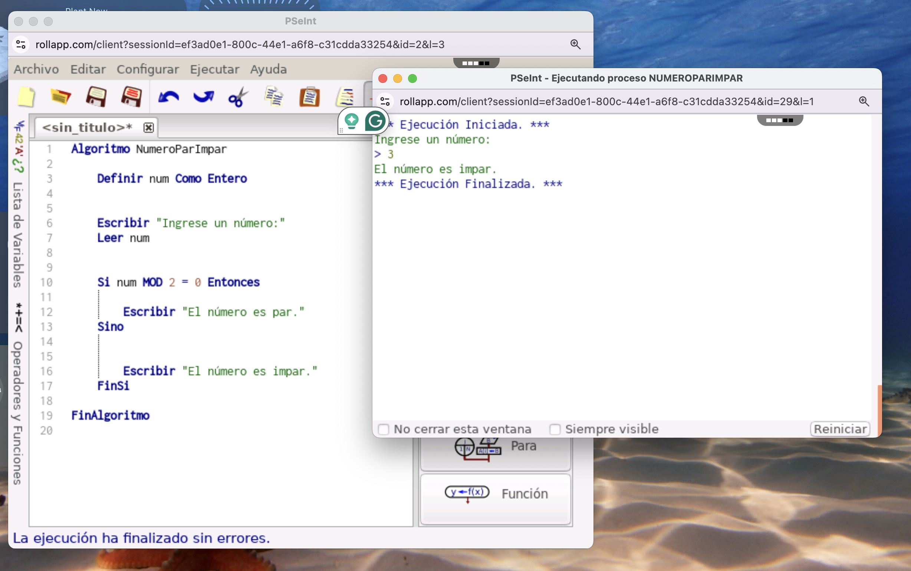

# 🧮 Algoritmo Número Par o Impar

Este programa en **PSeInt** permite al usuario ingresar un número entero y determina si es **par** o **impar**, utilizando una estructura condicional simple y el operador `MOD`.

---

## 📋 ¿Cómo funciona?

El algoritmo realiza los siguientes pasos:

1. Solicita al usuario que ingrese un número.
2. Verifica si el número es divisible entre 2 (usando `MOD 2 = 0`).
3. Muestra en pantalla si el número es par o impar.

---


 

---

## 🚀 ¿Cómo ejecutarlo?

### ▶️ Pasos:

1. Abre **PSeInt**.
2. Crea un nuevo archivo y copia el siguiente código:

```pseudocode
Algoritmo NumeroParImpar
    Definir num Como Entero

    Escribir "Ingrese un número:"
    Leer num

    Si num MOD 2 = 0 Entonces
        Escribir "El número es par."
    Sino
        Escribir "El número es impar."
    FinSi
FinAlgoritmo

